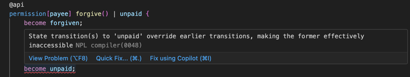
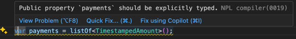
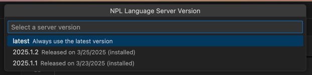

# NPL-Dev for VS Code

A VS Code extension providing support for the Noumena Protocol Language (NPL), with language server integration.

## Overview

This extension provides support for the Noumena Protocol Language (NPL) in VS Code (and VS Code forks such as Cursor).

## Features

- **Syntax highlighting** Out-of-the-box support for `.npl` files with custom syntax highlighting.

- **Language Server support** Integrates seamlessly with the NPL Language Server for real-time feedback

### Error and Warning Diagnostics

Detailed diagnostics are provided via the NPL Language Server, including inline errors and warnings during development.
These are the same errors and warnings you would get when compiling your NPL code.

### Version Management

You can easily switch between different versions of the NPL Language Server to match your project's needs (e.g. using
deprecated syntax). The versions correspond to Noumena Platform releases.

You can access this feature by running the command `NPL: Select Language Server Version` from the Command Palette
(`Ctrl+Shift+P` on Windows/Linux, `Cmd+Shift+P` on macOS).

## Commands

Available commands can be accessed by opening the Command Palette (`Ctrl+Shift+P` on Windows/Linux, `Cmd+Shift+P` on
macOS) and typing "NPL":

- `NPL: Select Language Server Version` - Choose which version of the language server to use
- `NPL: Clean Language Server Files and Reset` - Clean up language server files and reset to default state

## Configuration

The extension can be configured through VS Code settings:

- `NPL.server.version`: Version of the language server to use. Use 'latest' for the most recent version, or run the
  'NPL: Select Language Server Version' command for a visual picker with auto-download.

## Installation from VSIX

Some VS Code forks (like Cursor) have outdated extension marketplaces. In this case, you can install the extension
manually using the VSIX file. Instructions can be found [here](https://www.cursor.com/how-to-install-extension).

The VSIX file can also be downloaded from our
[GitHub releases](https://github.com/NoumenaDigital/npl-vscode-extension/releases).
